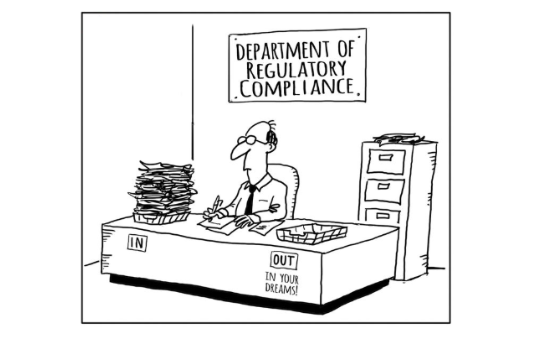

# About me

I am a doctoral student at the Department of Government of the University of Texas at Austin. 
My research is motivated by the following questions: How do states exercise power beyond 
their national borders in the era of globalization? How do business decisions of multinational 
corporations facilitate/constrain states' foreign economic policies? I seek to answer these questions 
in the context of economic sanctions, investigating multinational corporations' design and implement 
sanction compliance programs and their implications for the sanction regulatory regimes.

#{:.lead width="1920" height="1080" loading="lazy"}
